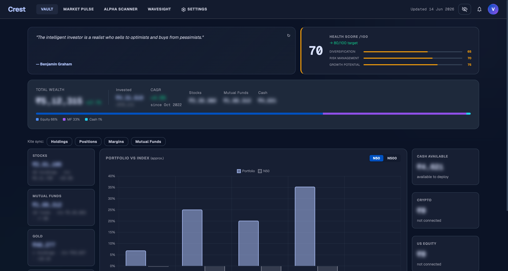
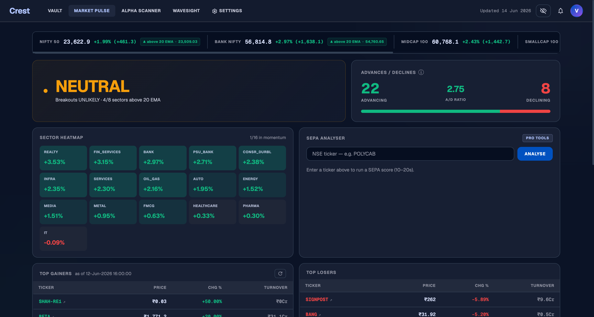
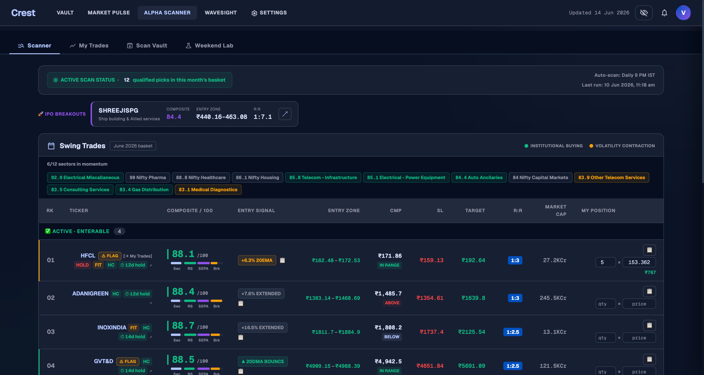
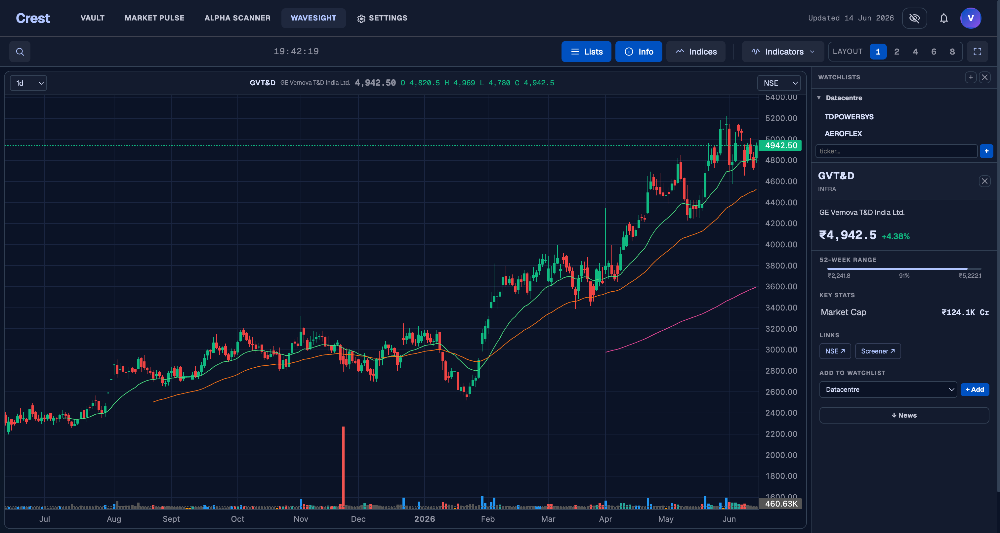
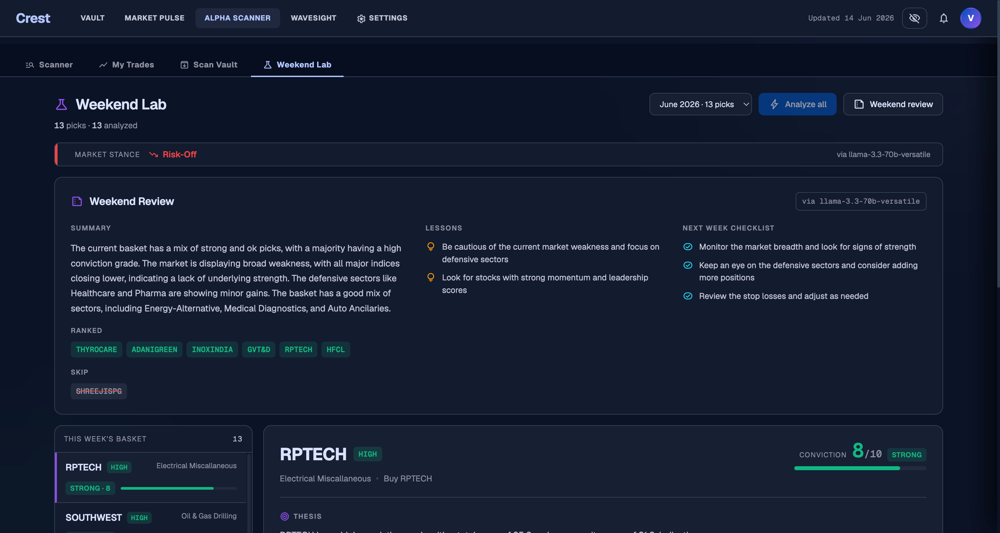
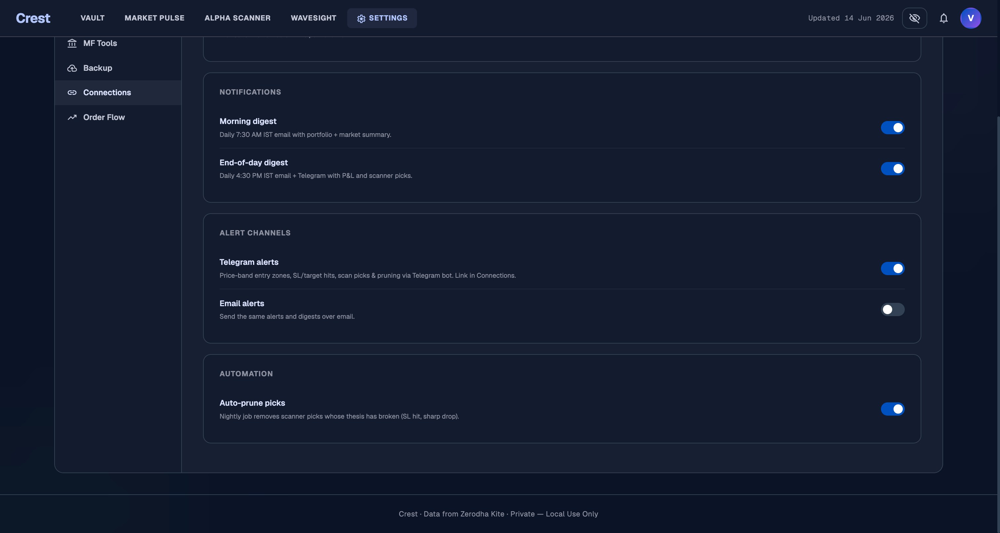

<div align="center">

# 📈 Crest

### The open-source, self-hosted command center for Indian stock investors.

Portfolio tracking · a 9-stage alpha scanner · a swing-trading framework · AI verdicts — in one app you run on your own machine, with your own data.

<br>

[-blue.svg)](LICENSE)
[](#-quick-start-docker)
[](#-tech-stack)
[](#-tech-stack)
[](#-contributing)

<sub>Self-host the kind of dashboard you'd otherwise rent — your portfolio never leaves your machine.</sub>

<br>

**[Quick Start](#-quick-start-docker) · [Features](#-what-you-get) · [Screenshots](#-screenshots) · [Phone Access](#-use-it-from-your-phone) · [License](#-license)**

</div>

---

> ⚠️ **Not investment advice.** Crest is an educational, personal research tool. Nothing it outputs is a recommendation. See [DISCLAIMER.md](DISCLAIMER.md).

## Why Crest?

Indian retail investors juggle a dozen tabs — broker app, a screener, a charting site, a watchlist, a spreadsheet for P&L, a Telegram group for ideas. Crest folds all of that into **one self-hosted app** that:

- 🔒 **Keeps your data yours.** Runs on your laptop, home server, or a private VPS. Your holdings never touch someone else's cloud.
- 🧠 **Thinks with you.** A free-first AI router (Groq, Gemini, Cerebras, OpenRouter…) scores ideas, tracks outcomes, and writes a daily market note — using *your* API keys, encrypted at rest.
- 🆓 **Costs nothing to run.** No subscription, no seat fees. Bring free-tier data + free-tier LLM keys and you're done.
- 🔧 **Is yours to bend.** Open source. Fork it, theme it, add a module. (Just don't sell it — see [license](#-license).)

## ✨ What you get

| | Module | What it does |
|---|---|---|
| 🗃️ | **Vault** | Full portfolio view — stocks, ETFs, gold, mutual funds. Live P&L, SEPA quality scores, alpha vs Nifty, sector & market-cap breakdown. |
| 📊 | **Market Pulse** | Live market dashboard — index tape, market breadth, sector heatmap, top gainers/losers, news feed. |
| 🎯 | **Alpha Scanner** | A 9-stage composite scanner (sector momentum · RS leadership · SEPA · breakout) with risk-sized entry bands, a rolling weekly basket with churn protection, and a scan vault to review history. |
| 📈 | **Wavesight** | Interactive OHLC charts, side-panel watchlist, news drawer, and build-your-own custom indices. |
| ⭐ | **Watchlist** | Multi-list watchlists with per-stock quote, 52-week range, and news. |
| ⚙️ | **Settings** | Read-only Zerodha (Kite) sync, bring-your-own LLM keys (encrypted vault), mutual-fund tools, one-click backup. |

Under the hood: an **agentic verdict engine** that scores ideas and grades its own past calls, **23 scheduled jobs** keeping data fresh, and notifications via **Telegram bot** and **email digests**.

## 🚀 Quick start (Docker)

Two containers (app + Postgres). All you need is Docker.

```bash
git clone https://github.com/<your-username>/crest-app.git
cd crest-app

# 1. Create your env file
cp .env.example .env

# 2. Generate the two required secrets, paste them into .env
python3 -c "import secrets; print('SESSION_SECRET =', secrets.token_hex(32))"
python3 -c "from cryptography.fernet import Fernet; print('FERNET_KEY     =', Fernet.generate_key().decode())"

# 3. Build & launch
docker compose up -d --build

# 4. Open it
open http://localhost:8000      # first boot ~15s (auto-migrates, starts scheduler)
```

That's it. Your data persists in Docker volumes across rebuilds. Update anytime with `git pull && docker compose up -d --build`.

> 💡 **LLM keys are optional.** Add any you have (all have free tiers) to `.env`, or skip them and the AI features stay dormant. **Auth is off by default** — ideal for personal/LAN use.

## 📱 Use it from your phone

The UI is responsive. Two easy ways:

1. **Same Wi-Fi** — open `http://<your-computer-ip>:8000` on your phone (`ipconfig getifaddr en0` on macOS gives the IP).
2. **Anywhere (recommended)** — install [Tailscale](https://tailscale.com) on host + phone, open `http://<host-tailscale-ip>:8000`. Private, encrypted, zero port-forwarding.

> Exposing Crest beyond your LAN? Turn on auth: set `auth.enabled=true` in `config.json` and add Google OAuth credentials. Never put it on the open internet without auth.

## 📸 Screenshots

**Vault** — portfolio intelligence: health score, allocation, P&L, alpha vs index _(amounts blurred via the built-in privacy toggle)_


**Market Pulse** — live breadth, sector heatmap, advances/declines, SEPA analyser


**Alpha Scanner** — 9-stage composite scores, weekly basket, risk-sized entry zones & R:R


**Wavesight** — OHLC charting with watchlist, stock info & news drawer


**Weekend Lab** — AI market stance, weekend review & next-week checklist, conviction-scored basket


**Settings** — notification digests, alert channels, and automation toggles (bring-your-own keys, all local)


## 🧱 Tech stack

| Layer | Tech |
|---|---|
| Backend | FastAPI · SQLAlchemy · Alembic · APScheduler |
| Database | PostgreSQL |
| AI | Free-first multi-provider LLM router · Fernet-encrypted BYO-key vault |
| Frontend | Vanilla-JS SPA (no build step) · lightweight-charts |
| Integrations | Read-only Zerodha (Kite) · Telegram · SMTP digests |

## 🛠️ Run without Docker (dev)

```bash
cd backend
python -m venv .venv
.venv/bin/pip install -r requirements.txt
cp config.example.json config.json          # then edit holdings / email
# create backend/.env with DATABASE_URL + FERNET_KEY + SESSION_SECRET
.venv/bin/python -m uvicorn main:app --port 8000
```

Postgres must be up first. Migrations apply automatically on startup.

## 🤝 Contributing

Issues and PRs welcome — new data sources, modules, themes, fixes. The frontend has no build step (plain JS), so the contribution loop is fast. Please keep changes focused and include a short description.

## 📄 License

Crest is **source-available and free to self-host** — Apache License 2.0 **as modified by the Commons Clause**, plus the binding plain-language terms in [LICENSE](LICENSE).

| ✅ You may | ❌ You may not |
|---|---|
| Use, self-host, and run it free (personal or business) | Sell, resell, or sublicense it for a fee |
| Study and modify the source | Offer it as a paid hosted / managed service |
| Share and redistribute (with the license intact) | Rename / fork to get around these terms |

In short: **free forever to run, never for resale.** Only the original author may sell Crest.

## ⚖️ Disclaimer

For education and personal research only. **Not investment advice**, not a SEBI-registered advisory service. Market data and AI output can be wrong. Every investment decision is yours. Full text: [DISCLAIMER.md](DISCLAIMER.md).

---

<div align="center">
<sub>If Crest is useful to you, <b>⭐ star the repo</b> — it genuinely helps others find it.</sub>
</div>
